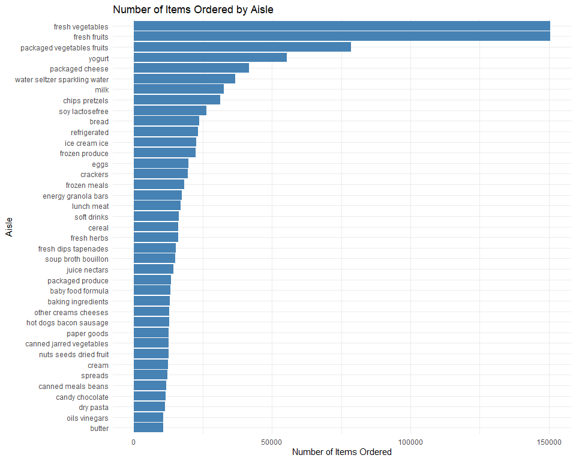
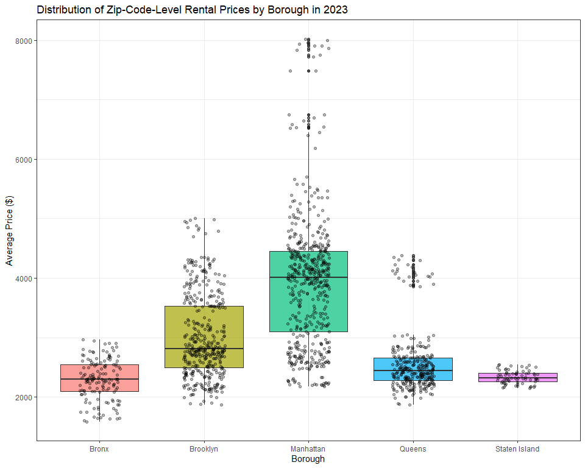
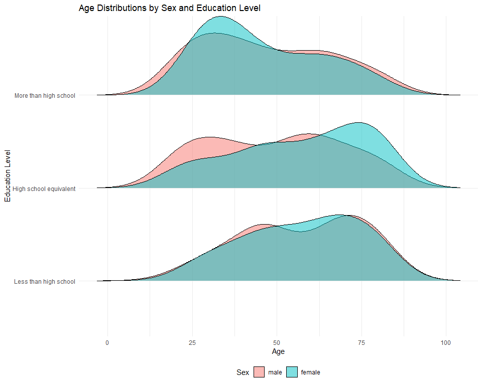
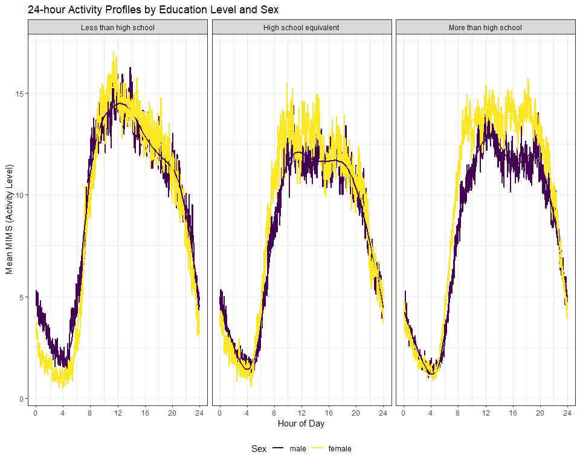

p8105_hw3_mb5357
================
Maria Beg
2025-10-07

## QUESTION 1

**Description of the Instacart Dataset**

The `instacart` dataset is a line-item level table of grocery orders
from Instacart, where each row represents a single product in a single
order.

The dataset contains 13,844,617 observations and 15 variables.

Key variables include `order_id`, `product_id`, `user_id`,
`add_to_cart_order` (position of the item in the cart), `reordered`
(0/1), `order_dow` (day of week), and `order_hour_of_day`. Orders are
categorized by `eval_set`, and user purchase history is captured via
`order_number`.

The dataset can be joined with metadata tables such as `products`,
`aisles`, and `departments` using `product_id`. In this version of the
dataset, all observations come from the “train” evaluation set.

For example, user 112108 placed their 4th order on day 4 of the week at
10 AM. This order (order ID 1) contained eight products, including
“Bulgarian Yogurt”, “Organic Celery Hearts”, and “Organic Hass Avocado”.
Each product appears in a separate row, with variables indicating the
order in which the item was added to the cart (e.g., “Bulgarian Yogurt”
was first), whether it was reordered (1 = yes, 0 = no), and what aisle
and department it belongs to (e.g., “fresh fruits” in the “produce”
department).

**Number of aisles and most ordered aisles**

``` r
aisle_counts <- instacart |>
  count(aisle, 
        name = "orders", sort = TRUE)

total_aisles <- nrow(aisle_counts) 

aisle_counts |>
  mutate(total_aisles = total_aisles) |>
  relocate(total_aisles, .before = aisle)
```

    ## # A tibble: 134 × 3
    ##    total_aisles aisle                         orders
    ##           <int> <chr>                          <int>
    ##  1          134 fresh vegetables              150609
    ##  2          134 fresh fruits                  150473
    ##  3          134 packaged vegetables fruits     78493
    ##  4          134 yogurt                         55240
    ##  5          134 packaged cheese                41699
    ##  6          134 water seltzer sparkling water  36617
    ##  7          134 milk                           32644
    ##  8          134 chips pretzels                 31269
    ##  9          134 soy lactosefree                26240
    ## 10          134 bread                          23635
    ## # ℹ 124 more rows

*There are 134 aisles in total. Fresh vegetables and fresh fruits aisles
are the most items ordered from.*

**Plot of items ordered per aisle**

``` r
instacart |>
  count(
    aisle, sort = TRUE) |>
  
  filter(
    n > 10000) |>
  
  mutate(
    aisle = reorder(aisle, n)) |>
  
  ggplot(aes(x = n, y = aisle)) +
  geom_col(fill = "steelblue") +
  labs(
    title = "Number of Items Ordered by Aisle",
    x = "Number of Items Ordered",
    y = "Aisle"
  ) +
  theme_minimal()
```

<!-- -->

**Top 3 items in selected aisles**

``` r
top_items_table <- instacart |>
  filter(aisle == "baking ingredients" | 
         aisle == "dog food care" | 
         aisle == "packaged vegetables fruits") |>
  
  count(
    aisle, 
    product_name, 
    name = "orders") |> 
  
  group_by(aisle) |> 
  slice_max(orders, n = 3) |> 
  ungroup()

top_items_table |> 
  kable()
```

| aisle | product_name | orders |
|:---|:---|---:|
| baking ingredients | Light Brown Sugar | 499 |
| baking ingredients | Pure Baking Soda | 387 |
| baking ingredients | Cane Sugar | 336 |
| dog food care | Snack Sticks Chicken & Rice Recipe Dog Treats | 30 |
| dog food care | Organix Chicken & Brown Rice Recipe | 28 |
| dog food care | Small Dog Biscuits | 26 |
| packaged vegetables fruits | Organic Baby Spinach | 9784 |
| packaged vegetables fruits | Organic Raspberries | 5546 |
| packaged vegetables fruits | Organic Blueberries | 4966 |

**Mean order hour for “Pink Lady Apples” and “Coffee Ice Cream” by day
of week**

``` r
day_names <- c("Sun", "Mon", "Tue", "Wed", "Thu", "Fri", "Sat")

mean_hour_table <- instacart |>
  filter(product_name == "Pink Lady Apples" | 
         product_name == "Coffee Ice Cream") |>
   
   mutate(day_name = factor(day_names[order_dow + 1], 
                             levels = day_names)) |>
   
   group_by(product_name, 
           day_name) |>
    
  summarize(mean_order_hour = round(mean(order_hour_of_day), 1), 
              .groups = "drop") |>
   
   pivot_wider(
    names_from = day_name,
    values_from = mean_order_hour
    )

mean_hour_table |> 
  kable()
```

| product_name     |  Sun |  Mon |  Tue |  Wed |  Thu |  Fri |  Sat |
|:-----------------|-----:|-----:|-----:|-----:|-----:|-----:|-----:|
| Coffee Ice Cream | 13.8 | 14.3 | 15.4 | 15.3 | 15.2 | 12.3 | 13.8 |
| Pink Lady Apples | 13.4 | 11.4 | 11.7 | 14.2 | 11.6 | 12.8 | 11.9 |

## Question 2

**Import and Clean the datasets**

``` r
zipcodes_df <- read_csv("Zip Codes.csv", show_col_types = FALSE) |>
  janitor::clean_names() |>
  mutate(
    zip_code = str_pad(as.character(zip_code), 
                       width = 5, 
                       side = "left", 
                       pad = "0"),
    county = case_when(
      county == "New York" ~ "Manhattan",
      county == "Kings"    ~ "Brooklyn",
      county == "Richmond" ~ "Staten Island",
      TRUE ~ county
    )
  ) |>
  distinct(zip_code, .keep_all = TRUE)


zori_df <- read_csv("Zip_zori_uc_sfrcondomfr_sm_month_NYC.csv", 
                    show_col_types = FALSE) |>
  janitor::clean_names()|>
  pivot_longer(
    cols = starts_with("x20"), 
    names_to = "date", 
    values_to = "zori"
  ) |>
  rename(zip_code = region_id, 
         region_name = region_name, 
         county = county_name) |>
  mutate(
    zip_code = str_pad(as.character(zip_code), 
                       width = 5, 
                       side = "left", 
                       pad = "0"),
    date = ymd(str_remove(date, "x")),
    zori = as.numeric(gsub(",", "", zori)),   
    year = year(date),
    month = month(date),
    county = case_when(
    county == "New York County" ~ "Manhattan",
    county == "Kings County" ~ "Brooklyn",
    county == "Richmond County" ~ "Staten Island",
    county == "Queens County" ~ "Queens",
    county == "Bronx County" ~ "Bronx",
    TRUE ~ county)
  ) |>
  select(zip_code, region_name, county, date, year, month, zori)


combined_df <- left_join(zori_df, zipcodes_df, by = "zip_code") |>
  mutate(county = coalesce(county.x, county.y)) |>
  select(zip_code, county, region_name, date, zori) |>
  rename(borough = county)
```

**ZIP Codes Observation**

``` r
zip_counts <- combined_df |> 
  group_by(zip_code) |> 
  summarize(n_months = n()) |> 
  ungroup()

zip_counts |>
  summarize(
    full_coverage = sum(n_months == 116),
    very_sparse = sum(n_months < 10)
  )
```

    ## # A tibble: 1 × 2
    ##   full_coverage very_sparse
    ##           <int>       <int>
    ## 1           149           0

A total of 149 ZIP codes have complete data, appearing in all 116 months
from January 2015 to August 2024. Conversely, 0 ZIP codes are observed
fewer than 10 times during this period. ZIP codes with full coverage
likely represent stable residential areas with consistent rental
activity and reliable data reporting. Those with sparse observations may
reflect areas with limited rental market activity, newer ZIP codes, or
data gaps.

**Average rental price per borough and year**

``` r
borough_year_table <- combined_df |>
  select(date, borough, zori) |> 
  mutate(year = year(date)) |> 
  group_by(borough, year) |> 
  
   summarize(avg_rent = mean(zori, na.rm = TRUE)) |>
 
   arrange(borough, year, avg_rent) |>
 
   pivot_wider(
    names_from = borough,
    values_from = avg_rent
  )
```

    ## `summarise()` has grouped output by 'borough'. You can override using the
    ## `.groups` argument.

``` r
borough_year_table |> 
  kable()
```

| year |    Bronx | Brooklyn | Manhattan |   Queens | Staten Island |
|-----:|---------:|---------:|----------:|---------:|--------------:|
| 2015 | 1759.595 | 2492.928 |  3022.042 | 2214.707 |           NaN |
| 2016 | 1520.194 | 2520.357 |  3038.818 | 2271.955 |           NaN |
| 2017 | 1543.599 | 2545.828 |  3133.848 | 2263.303 |           NaN |
| 2018 | 1639.430 | 2547.291 |  3183.703 | 2291.918 |           NaN |
| 2019 | 1705.589 | 2630.504 |  3310.408 | 2387.816 |           NaN |
| 2020 | 1811.443 | 2555.051 |  3106.517 | 2315.632 |      1977.608 |
| 2021 | 1857.777 | 2549.890 |  3136.632 | 2210.787 |      2045.430 |
| 2022 | 2054.267 | 2868.199 |  3778.375 | 2406.038 |      2147.436 |
| 2023 | 2285.459 | 3015.184 |  3932.610 | 2561.615 |      2332.934 |
| 2024 | 2496.896 | 3126.803 |  4078.440 | 2694.022 |      2536.442 |

From 2015 to 2024, average rental prices steadily increased across all
boroughs with available data. Manhattan consistently exhibits the
highest rents, followed by Brooklyn and Queens. The Bronx has the lowest
average rents but demonstrates notable growth over the period. Data for
Staten Island begins in 2020, showing a similar upward trend. Overall,
the table reflects a citywide rise in rental prices, with Manhattan and
Brooklyn leading both in cost and growth.

**NYC rental prices within ZIP codes**

``` r
library(ggplot2)

plot_1 <- combined_df |>
  filter(!is.na(zori)) |>
  mutate(year = year(date)) |>
  
  ggplot(aes(x = year, 
             y = zori, 
             group = zip_code, 
             color = borough)) +
  
  geom_line(alpha = 0.5) +                      
  stat_summary(aes(group = borough),              
               fun = median, 
               geom = "line", 
               color = "black", 
               size = 1) +
  
  facet_wrap(~ borough, scales = "free_y") +     
  
  scale_x_continuous(
    breaks=seq(2015, 2024, by = 2)) +
    
  labs(
    title = "NYC Rental Prices by ZIP Code Across Boroughs",
    x = "Year",
    y = "Rental Price (ZORI)",
    color = "Borough"
  ) +
  theme_minimal() +
    theme(legend.position = "none")
```

    ## Warning: Using `size` aesthetic for lines was deprecated in ggplot2 3.4.0.
    ## ℹ Please use `linewidth` instead.
    ## This warning is displayed once every 8 hours.
    ## Call `lifecycle::last_lifecycle_warnings()` to see where this warning was
    ## generated.

``` r
plot_1
```

<!-- -->

From 2015 to 2024, average rental prices rose in all NYC boroughs, with
a dip or slowdown around 2020–2021 likely reflecting pandemic effects.
Rents began rising sharply again in 2022. Manhattan consistently had the
highest average rents, while the Bronx saw the largest relative
increase. By 2024, the gap between boroughs had narrowed somewhat,
suggesting prices are rising more quickly in outer boroughs. Staten
Island data is available only from 2020 onward.

**ZIP-Code level Rent**

``` r
plot_2 <- combined_df |>
    filter(!is.na(zori),
           year(date) == 2023) |>
  
  group_by(borough, 
           zip_code, 
           date) |>
  
  summarize(avg_rent = mean(zori, na.rm = TRUE), 
            .groups = "drop") |>

        ggplot(aes(x = borough, 
              y = avg_rent, 
              fill = borough)) +
  
  geom_boxplot(alpha = 0.7) +   
  geom_jitter(width = 0.2, 
              alpha = 0.3, 
              size = 1) + 
    labs(
    title = "Distribution of Zip-Code-Level Rental Prices by Borough in 2023",
    x = "Borough",
    y = "Average Price ($)",
    fill = "Borough"
  ) +
  theme_bw() +
  theme(legend.position = "none")


plot_2
```

<!-- -->

The boxplot shows clear differences in ZIP-level average rents across
boroughs in 2023. Manhattan has the highest median ZIP rent and the
greatest dispersion, with a wide interquartile range (IQR) and a long
upper tail driven by several very high-rent ZIP codes. Brooklyn follows,
with a relatively high median and substantial variability. Queens, the
Bronx, and Staten Island have lower and more similar medians, with
Staten Island showing the narrowest IQR, indicating more uniform
ZIP-level rents. A few outliers with extremely high rents are visible,
likely due to luxury listings or data anomalies.

**Combined Plots**

``` r
library(patchwork)

combined_plot <- plot_1 / plot_2 

ggsave("results/combined_plot.png", combined_plot, width = 10, height = 8)
```

## Question 3

**Import and Clean the datasets**

``` r
accel_df <- read_csv("nhanes_accel.csv", show_col_types = FALSE) |>
  pivot_longer(
    cols = starts_with("min"),
    names_to = "minute",
    values_to = "mims"
  ) |>
  mutate(minute = as.integer(str_remove(minute, "min")))


sex_levels <- c("male", "female")
education_levels <- c("Less than high school", "High school equivalent", "More than high school")

covar_df <- read_csv("nhanes_covar.csv", skip = 4, show_col_types = FALSE) |>
  mutate(
    sex = case_when(
      sex == 1 ~ sex_levels[1],
      sex == 2 ~ sex_levels[2],
      TRUE ~ NA_character_
    ),
    
    education = case_when(
      education == 1 ~ education_levels[1],
      education == 2 ~ education_levels[2],
      education == 3 ~ education_levels[3],
      TRUE ~ NA_character_
    )
    
  ) |>
  filter(age >= 21) |>

  mutate(
    sex = factor(sex, levels = sex_levels),
    education = factor(education, levels = education_levels, ordered = TRUE)
  )


nhanes_df <- left_join(accel_df, covar_df, 
                       by = "SEQN") |>
             drop_na(sex, age, education)
```

**Number of men and women in each education category**

``` r
sex_dist_table <- covar_df |>
  count(education, sex) |>
  
  pivot_wider(
    names_from = sex,
    values_from = n,
    values_fill = 0
  )

sex_dist_table |> 
  kable()
```

| education              | male | female |
|:-----------------------|-----:|-------:|
| Less than high school  |   28 |     29 |
| High school equivalent |   36 |     23 |
| More than high school  |   56 |     59 |

The table shows a fairly even gender distribution across education
levels. Most participants have more than a high school education, with
women slightly outnumbering men in that category. Men are more
represented in the high school equivalent group, while the lowest
education level is nearly balanced. Overall, the sample leans toward
higher educational attainment for both sexes.

**Visualization of Age Distributions**

``` r
library(ggridges)

ggplot(covar_df, aes(x = age, 
                     y = education, 
                     fill = sex)) +
  
  geom_density_ridges(alpha = 0.5, 
                      scale = .85) +
  labs(
    title = "Age Distributions by Sex and Education Level",
    x = "Age",
    y = "Education Level",
    fill = "Sex"
  ) +
  theme_minimal() +
    theme(legend.position = "bottom")
```

<!-- -->

The visualization shows how age distributions vary across education
levels for men and women. Higher education groups peak around ages
30–40, while lower education groups include more older adults (65+).
Within each education category, male and female age distributions
largely overlap, though women tend to be slightly older, especially in
the “Less than high school” group.

**Aggregate total activity per participant**

``` r
total_activity_df <- nhanes_df |> 
  group_by(SEQN, sex, age, education) |>
  
  summarise(total_mims = sum(mims, na.rm = TRUE), 
            .groups = "drop")
```

**Plot total activity vs age by sex and education**

``` r
ggplot(total_activity_df, 
       aes(x = age, 
           y = total_mims, 
           color = sex)) +
  geom_point(alpha = 0.6) +
  geom_smooth(se = FALSE) +
  
  facet_grid(~ education) +
  viridis::scale_color_viridis(discrete = TRUE) +
  
  labs(
    title = "Daily Total Activity by Age, Sex, and Education Level",
    x = "Age",
    y = "Total MIMS (Daily Activity)",
    color = "Sex"
  ) +
  theme_bw() +
    theme(legend.position = "bottom")
```

<!-- -->

The plot shows daily total physical activity by age, sex, and education
level. Activity generally declines with age across all groups, but
patterns differ by education. In “Less than high school,” activity drops
sharply, with women slightly more active than men. For “High school
equivalent” and “More than high school,” women consistently maintain
higher activity than men, and declines with age are more gradual,
especially in the highest education group. Overall, females tend to stay
more active, and higher education displays a pattern of a slower decline
in activity with age.

**Three-panel Plot**

``` r
nhanes_df <- nhanes_df |>
  mutate(hour = minute / 60)


ggplot(nhanes_df, aes(x = hour, 
                      y = mims, 
                      color = sex, 
                      group = sex)) +

 stat_summary(
    fun = mean,
    geom = "line",
    linewidth = 1,
  ) +

  geom_smooth(
    se = FALSE) +

  facet_grid(~ education) +
  viridis::scale_color_viridis(discrete = TRUE) +
   
  scale_x_continuous(
   breaks = seq(0, 24, by = 4)) +
  
   labs(
    title = "24-hour Activity Profiles by Education Level and Sex",
    x = "Hour of Day",
    y = "Mean MIMS (Activity Level)",
    color = "Sex"
  ) +
  theme_bw() + 
  theme(legend.position = "bottom")
```

<!-- -->

The plot shows mean physical activity (MIMS) over 24 hours, separated by
sex and education level. In all groups, activity increases in the
morning, peaks mid-day, and declines at night, reflecting typical daily
routines. Women consistently show higher activity than men, especially
among those with more than a high school education. This group also
maintains higher afternoon activity levels. While men follow a similar
pattern, their activity levels are lower overall. These trends highlight
consistent differences by sex and education, particularly in daytime
activity.
